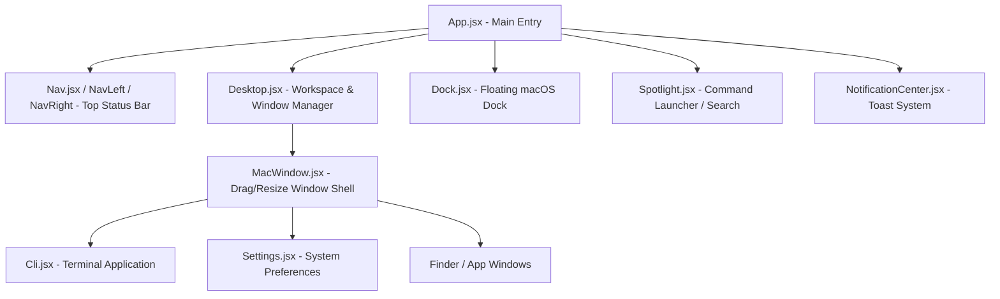

# Architecture & Directory Structure

This document outlines the architectural patterns, component structure, state management flow, and asset organization of **ManOS.dev**.

---

## 🏗️ High-Level System Architecture

ManOS.dev is constructed as a modern, client-side macOS desktop simulator built using **React 18**, **Vite**, and **Vanilla SCSS**.



---

## 📂 Project Directory Structure

```text
ManOS.dev/
├── docs/                           # Comprehensive Project Documentation
│   ├── memory.md                   # Memory of recent changes & updates
│   ├── architecture.md             # System architecture & file tree
│   ├── design.md                   # UI/UX design system & aesthetic guidelines
│   ├── prd.md                      # Product Requirements Document
│   └── trd.md                      # Technical Requirements Document & Stack
├── public/                         # Static Assets & Icons
│   └── icons/                      # macOS App Icons (Terminal, Finder, Settings, etc.)
├── src/
│   ├── assets/                     # Fonts, Images & Audio Effects
│   │   └── audio/                  # System Sound Effects (click, lock, unlock, wallpaper)
│   ├── components/                 # React UI Components
│   │   ├── windows/                # Window Applications & Window Shell
│   │   │   ├── MacWindow.jsx       # Universal Window Shell (Titlebar, Drag, Min/Max/Close)
│   │   │   ├── MacWindow.scss      # Window Glassmorphism & Controls Styling
│   │   │   ├── Cli.jsx             # Terminal Application & Interactive Engine
│   │   │   ├── Cli.scss            # Terminal Line Renderers, Cards & Theme Styles
│   │   │   ├── Desktop.jsx         # Main Desktop Manager (Wallpaper, Right-Click, App States)
│   │   │   ├── Settings.jsx        # System Preferences Window
│   │   │   └── Settings.scss       # Settings UI Styles
│   │   ├── DesktopMenu.jsx         # Desktop Right-Click Context Menu
│   │   ├── DesktopMenu.scss        # Context Menu Glassmorphic Styling
│   │   ├── Dock.jsx                # macOS Interactive Floating Dock
│   │   ├── Dock.scss               # Dock Magnification & Item Layout
│   │   ├── LockScreen.jsx          # Lock Screen Overlay
│   │   ├── LockScreen.scss         # Lock Screen Typography & Background Blur
│   │   ├── Nav.jsx                 # Top Navigation Bar Wrapper
│   │   ├── Nav.scss                # Top Nav Structure
│   │   ├── NavLeft.jsx             # Left Navbar Items (Apple Menu, Active App Title, Menus)
│   │   ├── NavLeft.scss            # Left Navbar Dropdown & Text Styles
│   │   ├── NavRight.jsx            # Right Navbar Status Icons (Control Center, Clock, Battery)
│   │   ├── NavRight.scss           # Right Navbar System Controls
│   │   ├── NotificationCenter.jsx  # Toast Notification Controller & Throttling
│   │   ├── NotificationCenter.scss # Toast Animation & Position
│   │   ├── Spotlight.jsx           # macOS Spotlight Search Modal (Cmd+K)
│   │   └── Spotlight.scss          # Spotlight Search Glassmorphic UI
│   ├── utils/                      # Helper Functions & Utilities
│   │   └── sound.js                # System Audio Player Utility
│   ├── App.jsx                     # Core OS Application Assembly
│   ├── App.scss                    # Root CSS Custom Properties & Base Styles
│   └── main.jsx                    # Vite React DOM Mount Point
├── index.html                      # HTML5 Entry Document
├── package.json                    # Project Dependencies & Scripts
├── vercel.json                     # Vercel Deployment Configuration
└── vite.config.js                  # Vite Build Configuration
```

---

## ⚡ Core Architecture Patterns

### 1. Universal Window Management (`MacWindow.jsx`)
- Wraps all active windows in a responsive, draggable, and resizable container.
- Manages window states: `open`, `minimized`, `maximized`, `closed`.
- Controls `zIndex` stacking order when a window receives focus.
- Automatically handles dock collision avoidance by clamping window heights.

### 2. Command Line Engine (`Cli.jsx`)
- Implements a custom terminal state machine (`lines` array).
- Maps `/command` input to reactive action handlers.
- Features custom line renderers: `help-table`, `about-card`, `bio-card`, `exp-card`, `skill-group`, `contact-grid`, `socials-grid`, `quote-card`, `project`, and `error-msg`.

### 3. State Persistence (`localStorage`)
- **Wallpaper Queue**: Stores current wallpaper URL and shuffle sequence (`ui-wallpaper`, `ui-wallpaper-queue`).
- **UI Settings**: Persists user preferences (`ui-settings` -> `focusMode`, `sound`, `soundLevel`, `brightness`, `autoCloseAfterUnlock`).

### 4. Global Event & Sound Pipeline (`window.dispatchEvent` & `sound.js`)
- Uses native browser events (`settingsUpdated`, `spotlightAction`, `openSpotlight`) for decoupled inter-component communication.
- Audio playback routed through a central audio utility (`playSound(effect)`).
